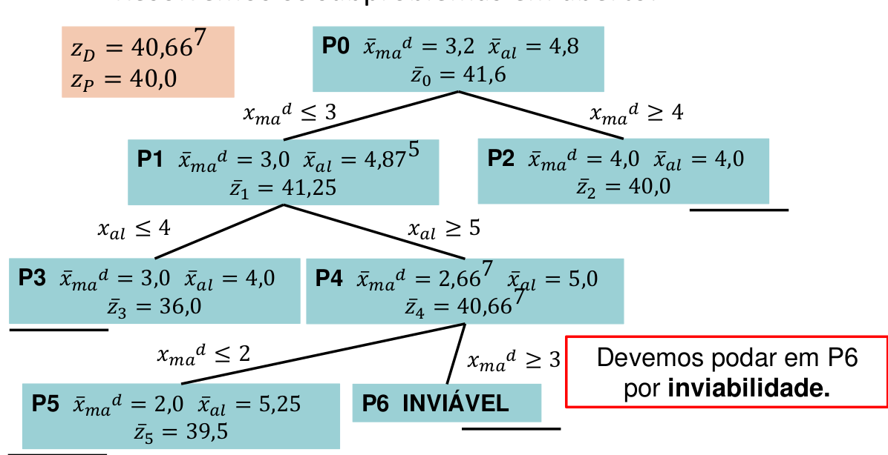
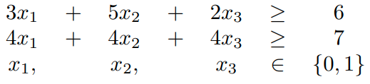

<h1 align="center">Operational research - Branch and Bound</h1>
<p>
  <a href="(https://cdn.rawgit.com/IBMDecisionOptimization/docplex-doc/2.0.15/docs/mp/index.html)" target="_blank">
    
  </a>
  <a href="(https://github.com/EraldoCi/operational-research/blob/master/LICENSE)" target="_blank">
    
  </a>

  
  
  
  <a href="https://github.com/marismarcosta">
    
  </a>
  <a href="https://github.com/EraldoCi">
    
  </a>
  <a href="https://www.linkedin.com/in/marismarcosta/">
    
  </a>
  <a href="https://www.linkedin.com/in/gustavoeraldo/">
    
  </a>
</p>

<p align="center">
  <a href="#prerequisites">Prerequisites</a>&nbsp;&nbsp;&nbsp;|&nbsp;&nbsp;&nbsp;
  <a href="#objective">Objective</a>&nbsp;&nbsp;&nbsp;|&nbsp;&nbsp;&nbsp;
  <a href="#algorithm-explanation">Algorithm explanation</a>&nbsp;&nbsp;&nbsp;|&nbsp;&nbsp;&nbsp;
  <a href="#input-setup">Input Setup</a>&nbsp;&nbsp;&nbsp;|&nbsp;&nbsp;&nbsp;
  <a href="#run">Run</a>&nbsp;&nbsp;&nbsp;|&nbsp;&nbsp;&nbsp;
  <a href="#License">License</a>
</p>


## Prerequisites

Install IBM Decision Optimization [CPLEX](http://ibmdecisionoptimization.github.io/docplex-doc/getting_started.html) Modeling for Python (DOcplex). If you have anaconda write this command :

```sh
conda install -c ibmdecisionoptimization cplex
```

Or use pip library :

```sh
pip install cplex
```

## Objective

Implement the branch and bound algorithm for binary linear programming. 


## Algorithm explanation
<!-- Translate and improve explanation 
- O método de branch-and-bound se baseia na resolução da relaxação linear de um problema.

- À medida que o método é executado, os limites primal e dual vão sendo atualizados

- O método faz uma enumeração implícita do espaço de soluções através de uma abordagem baseada no paradigma de divisão e conquista

As you can see in the follow example : 

<p align="center">
  
</p>

-->

## Input setup

You can use the [project sample](https://github.com/EraldoCi/operational-research/blob/master/branch-and-bound/problema.txt "problema.txt") for testing. For others inputs remeber to follow the pattern using **only numbers**.

<p align="center">
  
</p>

Subject to :

<p align="center">
  
</p>

Input format :

```sh
3 2 // there are 3 variables and 2 constraints
5 10 8 //variables coeficient of the objective xfunction
3 5 2 6 // constraint 1
4 4 4 7 // constraint 2
```

## Run

```sh
python bb.py
```


## Show your support

Give a ⭐️ if this project helped you!

<!-- 
## 📝 License

Copyright © 2020 [Gustavo Eraldo](https://github.com/EraldoCi), [Marismar Costa](https://github.com/marismarcosta).<br />
This project is [MIT]((https://github.com/EraldoCi/operational-research/tree/master/duality/LICENSE)) licensed.
 -->
