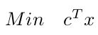
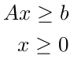
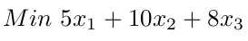
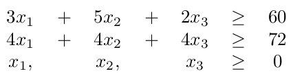

<h1 align="center">Operational research - Duality</h1>
<p>
  <a href="(https://cdn.rawgit.com/IBMDecisionOptimization/docplex-doc/2.0.15/docs/mp/index.html)" target="_blank">
    
  </a>
  <a href="(https://github.com/EraldoCi/operational-research/blob/master/LICENSE)" target="_blank">
    
  </a>

  
  
  
  <a href="https://github.com/marismarcosta">
    
  </a>
  <a href="https://github.com/EraldoCi">
    
  </a>
  <a href="https://www.linkedin.com/in/marismarcosta/">
    
  </a>
  <a href="https://www.linkedin.com/in/gustavoeraldo/">
    
  </a>
</p>

<p align="center">
  <a href="#prerequisites">Prerequisites</a>&nbsp;&nbsp;&nbsp;|&nbsp;&nbsp;&nbsp;
  <a href="#objective">Objective</a>&nbsp;&nbsp;&nbsp;|&nbsp;&nbsp;&nbsp;
  <a href="#input-setup">Input Setup</a>&nbsp;&nbsp;&nbsp;|&nbsp;&nbsp;&nbsp;
  <a href="#run">Run</a>&nbsp;&nbsp;&nbsp;|&nbsp;&nbsp;&nbsp;
  <a href="#License">License</a>
</p>

> This project aims to resolve a canonical minimize problem

## Prerequisites

Install IBM Decision Optimization [CPLEX](http://ibmdecisionoptimization.github.io/docplex-doc/getting_started.html) Modeling for Python (DOcplex). If you have anaconda write this command :

```sh
conda install -c ibmdecisionoptimization cplex
```

Or use pip library :

```sh
pip install cplex
```
More [examples](https://ibmdecisionoptimization.github.io/tutorials/html/Beyond_Linear_Programming.html#Use-IBM-Decision-Optimization-CPLEX-Modeling-for-Python) of usage.

## Objective

1. Read a minimize problem in canonical form.

<!--  -->
<p align="center">
  </img>
  <p>Subject to :</p>
</p>

<p align="center">
  </img>
</p>

 
2. Demonstrate if the primal's solution is optimal, unlimited or unfeasible. For the first case you must expose the optimal solution x*.

3. Build first item's dual.

4.  Demonstrate if the dual's solution is optimal, unlimited or unfeasible. For the first case you must expose the optimal solution y*.

5. If the solution x* exist, calculate and expose the surplus of each primal constraint.


6. If the solution y* exist, calculate and expose the surplus of each dual constraint.

<!-- 7. Caso existam as soluções x ∗ e y ∗ , exiba, para cada restrição do primal, o produto entre o excesso calculado e o valor da variável dual associada.

8. Caso existam as soluções x ∗ e y ∗ , exiba, para cada restrição do dual, o produto entre a folga calculada e o valor da variável primal associada. -->


## Input setup

You can use the [project sample](https://github.com/EraldoCi/operational-research/blob/master/project-1/problema.txt "problema.txt") to test. To test others examples remeber to follow the input pattern and use **only numbers**.

<p align="center">
  
</p>

Subject to :

<p align="center">
  
</p>

Input format :

```sh
3 2 // there are 3 variables and 2 constraints
5 10 8 //variables coeficient of the objective xfunction
3 5 2 60 // constraint 1
4 4 4 72 // constraint 2
```


## Run

```sh
python trabalho.py
```


## Show your support

Give a ⭐️ if this project helped you!

## 📝 License

Copyright © 2020 [Gustavo Eraldo](https://github.com/EraldoCi), [Marismar Costa](https://github.com/marismarcosta).<br />
This project is [MIT]((https://github.com/EraldoCi/operational-research/blob/master/duality/LICENSE)) licensed.
